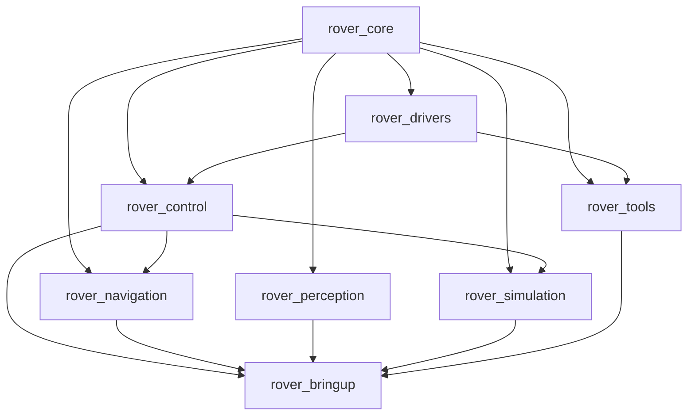

# Arquitectura del Sistema

Visión general de la arquitectura del Rover.

## Arquitectura de Workspaces

El proyecto está organizado en 8 workspaces independientes:

```
rover_core          → rover_drivers → rover_control
                                    → rover_navigation
                                    → rover_perception
                                    → rover_simulation
                                    → rover_tools
                                    → rover_bringup
```

### Dependencias



## Arquitectura de Nodos

### Sistema Completo

```
┌─────────────────────────────────────────────────┐
│                  rover_bringup                  │
│           (Integración y Launch Files)          │
└─────────────────────────────────────────────────┘
                        │
        ┌───────────────┼───────────────┐
        │               │               │
┌───────▼──────┐ ┌─────▼──────┐ ┌─────▼──────┐
│   Drivers    │ │  Control   │ │ Navigation │
│              │ │            │ │            │
│ RoboClaw     │ │ Base Ctrl  │ │   Nav2     │
│ IBUS         │ │ Teleop     │ │  AMCL      │
│ PX4          │ │            │ │  EKF       │
└──────────────┘ └────────────┘ └────────────┘
```

## Flujo de Datos

### Teleoperación

```
Joystick → joy_node → teleop_node → /cmd_vel → base_controller → RoboClaw → Motores
```

### Odometría

```
Encoders → RoboClaw → roboclaw_driver → /wheel_odom ─┐
IMU      → PX4      → px4_bridge      → /imu        ─┤→ EKF → /odom → TF
GPS      → PX4      → px4_bridge      → /gps        ─┘
```

### Navegación

```
/odom ─┐
/scan ─┤→ Nav2 → /cmd_vel → base_controller → Motores
/map ──┘
```

## Componentes Principales

### 1. Hardware Layer

**RoboClaw Drivers**
- Comunicación serial (115200 baud)
- Control de 4 motores (differential drive)
- Lectura de 4 encoders
- PWM control

**Sensor Drivers**
- PX4: IMU + GPS via uXRCE-DDS
- LIDAR: RPLiDAR via USB
- IBUS: Radio receiver via UART

### 2. Control Layer

**Base Controller**
- Cinemática diferencial
- Fusión de odometría
- Publicación de TF (odom → base_link)
- Control de velocidad

**Teleop**
- PS4 controller mapping
- FrSky IBUS mapping
- Dead man switch
- Velocity scaling

### 3. Navigation Layer

**Localization**
- Extended Kalman Filter (robot_localization)
- AMCL (con LIDAR)
- GPS fusion (opcional)

**Planning**
- Nav2 stack completo
- Costmap 2D
- Path planning (NavFn, SmacPlanner)
- Controller (DWB, TEB)

### 4. Perception Layer

**Sensores**
- LIDAR: Escaneo 2D
- Cámara: (futuro) Visión
- IMU: Orientación y aceleración
- GPS: Posición global

## Frames de Referencia (TF Tree)

```
map
 └─ odom
     └─ base_footprint
         └─ base_link
             ├─ lidar_link
             ├─ imu_link
             ├─ gps_link
             ├─ wheel_fl_link
             ├─ wheel_fr_link
             ├─ wheel_rl_link
             └─ wheel_rr_link
```

### Transformaciones

- `map → odom`: Publicado por localization (AMCL o EKF)
- `odom → base_link`: Publicado por odometry (encoders + IMU)
- `base_link → sensors`: Estático (URDF)

## Topics Principales

### Entrada

| Topic | Tipo | Descripción |
|-------|------|-------------|
| `/joy` | sensor_msgs/Joy | Datos de joystick |
| `/scan` | sensor_msgs/LaserScan | Datos de LIDAR |
| `/imu/data` | sensor_msgs/Imu | Datos de IMU |
| `/gps/fix` | sensor_msgs/NavSatFix | Posición GPS |

### Salida

| Topic | Tipo | Descripción |
|-------|------|-------------|
| `/cmd_vel` | geometry_msgs/Twist | Comandos de velocidad |
| `/odom` | nav_msgs/Odometry | Odometría fusionada |
| `/motor_status` | (custom) | Estado de motores |

### Navegación

| Topic | Tipo | Descripción |
|-------|------|-------------|
| `/map` | nav_msgs/OccupancyGrid | Mapa del entorno |
| `/goal_pose` | geometry_msgs/PoseStamped | Goal para navegación |
| `/path` | nav_msgs/Path | Ruta planificada |

## Parámetros de Configuración

Todos los parámetros están centralizados en:
```
rover_bringup/src/rover_config/config/rover_params.yaml
```

### Parámetros Críticos

```yaml
# Física del robot
wheel_radius: 0.075
wheelbase: 0.180
track_width: 0.250

# Encoders
encoder_cpr: 4096

# Velocidades máximas
max_linear_vel: 0.5   # m/s
max_angular_vel: 1.0  # rad/s

# Navegación
robot_radius: 0.15    # m
inflation_radius: 0.3 # m
```

## Modos de Operación

### 1. Modo Manual (Teleop)
- Control directo desde joystick
- Sin navegación autónoma
- Seguridad: dead man switch

### 2. Modo Semi-Autónomo
- Navegación con waypoints
- Evitación de obstáculos
- Operador puede intervenir

### 3. Modo Autónomo
- Navegación completamente autónoma
- Planning dinámico
- Re-planning en tiempo real

### 4. Modo Research
- Grabación de datos
- Múltiples fuentes de odometría
- Análisis de precisión

## Seguridad

### Hardware
- Emergency stop físico
- Voltage monitoring
- Current limiting en RoboClaw

### Software
- Watchdog en drivers
- Timeout en cmd_vel
- Collision detection
- Geofencing (opcional con GPS)

## Performance

### Frecuencias de Publicación

| Topic | Frecuencia |
|-------|-----------|
| `/odom` | 50 Hz |
| `/scan` | 10 Hz |
| `/imu/data` | 100 Hz |
| `/cmd_vel` | 20 Hz |

### Latencias

- Teleop: < 50ms
- Planning: < 100ms
- Control loop: 20ms (50Hz)

## Extensibilidad

El diseño modular permite agregar fácilmente:
- Nuevos sensores (cámara, ultrasónico)
- Algoritmos de navegación alternativos
- Modos de operación custom
- Data logging avanzado
